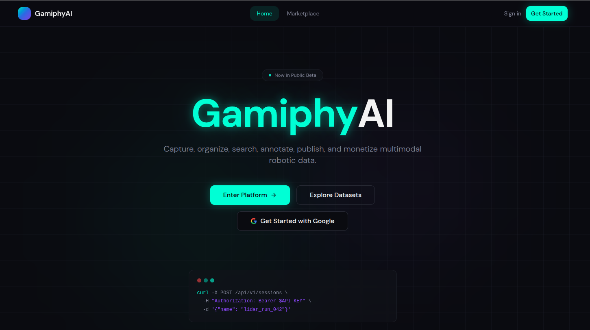
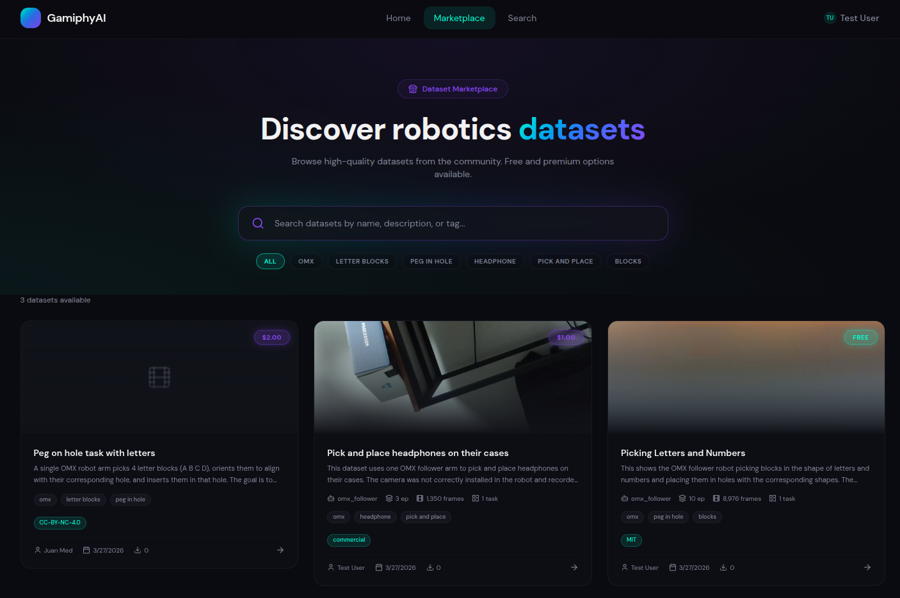
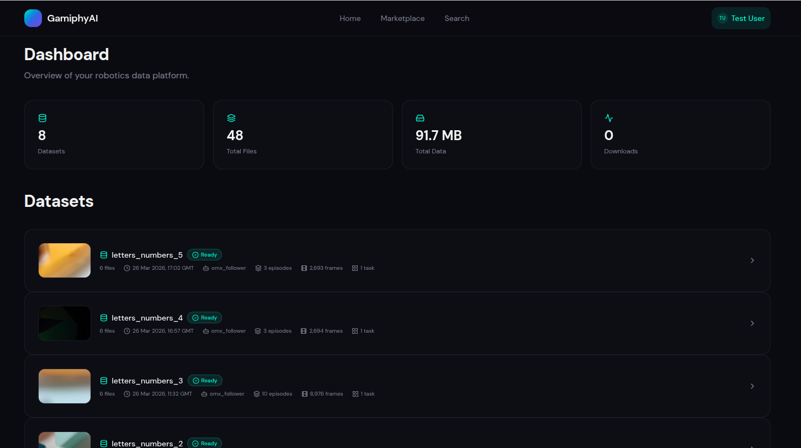
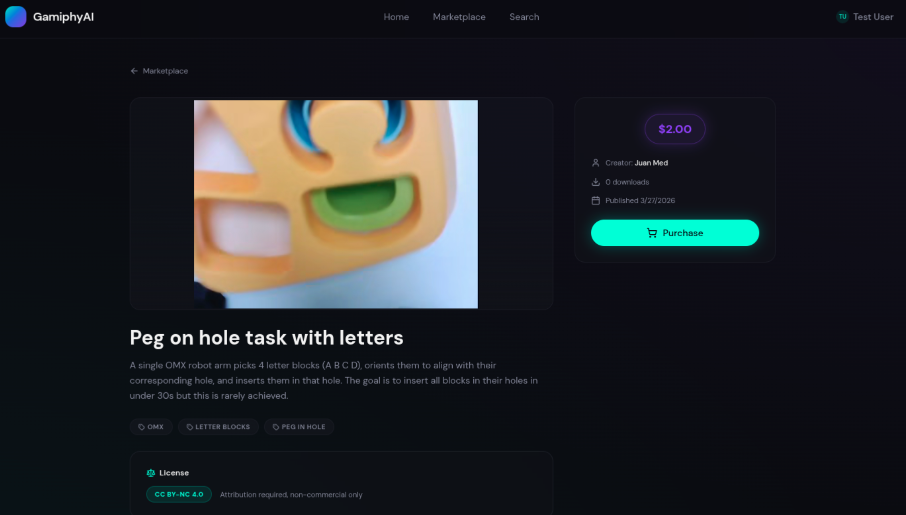
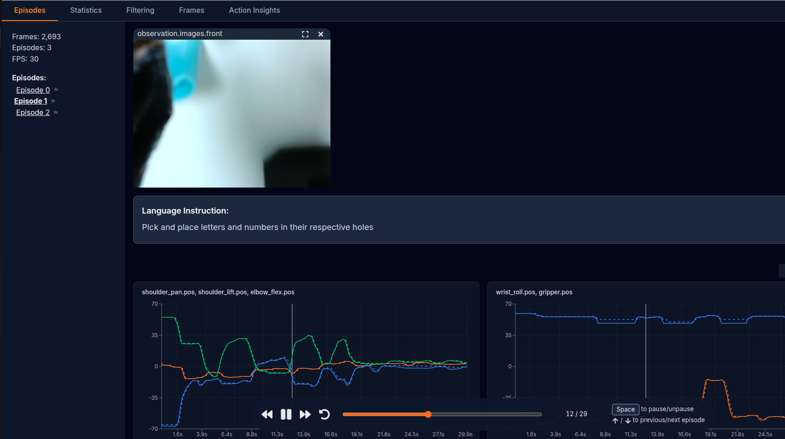
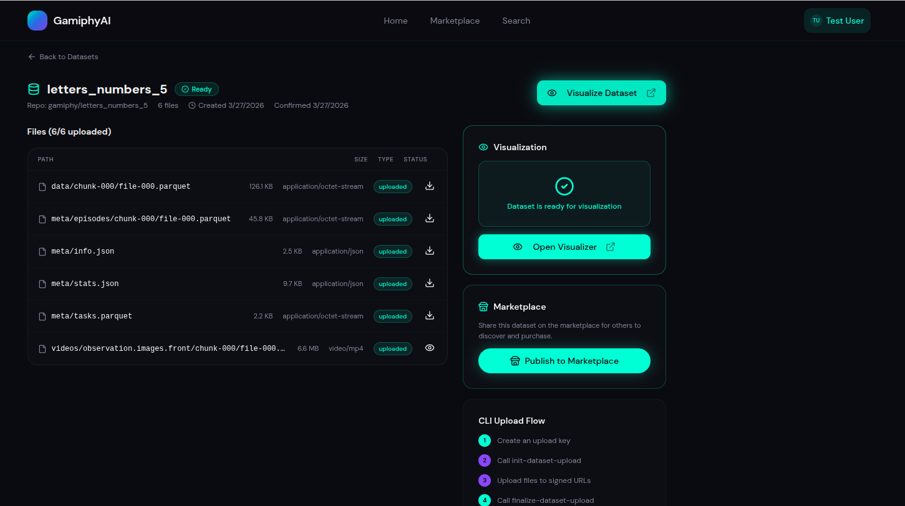

# GamiphyAI 사업 계획서

## 사업 개요
| 항목 | 내용 |
|------|------|
| **성명** | GamiphyAI |
| **기술분야** | 피지컬 AI를 위한 로봇 데이터 및 스킬 |
| **팀 명 (예비)** | 2 |
| **E‑mail / 휴대전화번호** | fer@gamiphy.ai / 010 8505 9134 |
| **아이템 개요** | GamiphyAI는 피지컬 AI를 위한 마켓플레이스입니다. 중소기업(SME) 제조 공정을 위한 로봇 자동화 솔루션을 제공하고, 로봇 제작자로부터 실제 환경 데이터셋과 솔루션을 공급받으며, AI 기반 로봇 기술이 주도할 미래 환경에서 브랜드 가시성을 평가하고 개선할 수 있는 플랫폼을 제공합니다. |

---

### 아이템 소개

#### 1. 문제 인식 (Problem)

##### 창업아이템 개발 동기

> **핵심 요점:** 로봇 AI는 언어 AI의 확장을 가능하게 한 데이터 인프라가 부족합니다. 중소 제조업체는 유연한 자동화가 필요하지만 전통적인 고정형 솔루션을 감당할 수 없으며, 로봇 공학자들은 데이터셋을 생성할 적절한 인센티브가 필요하고, OEM은 곧 이러한 데이터셋에서 가시성 격차에 직면하게 될 것입니다. GamiphyAI는 실제 고객 배포로부터 독점적인 로봇 데이터를 생성하는 서비스-플랫폼 모델을 통해 이러한 격차를 해소합니다.

**로봇 데이터 격차**

대규모 언어 모델은 인터넷 규모의 텍스트 코퍼스에서 확장되었습니다 — GPT-3는 필터링된 Common Crawl, WebText2, Books, Wikipedia에서 추출한 3,000억 개의 토큰으로 훈련되었습니다 [7]. 로봇 공학은 이와 동등한 데이터 조건을 누리지 못하고 있습니다. 로봇 학습은 다중 모달, 시간 상관, 구현 특정 데이터 — RGB, 깊이, 힘, 고유 수용, 동작, 실패, 안전 이벤트 — 에 의존하며, 이 모든 것은 물리적 세계에서 수집하는 데 더 느리고 비용이 많이 듭니다. 주요 협업 단계인 Open X-Embodiment조차도 22개 구현체에 걸친 60개 데이터셋에서 약 100만 개의 궤적만을 결합했습니다 [8]. 지능적이고 정교하며 강건한 로봇 조작을 가능하게 하는 데이터셋, 스킬, 모델을 생성하고 이를 더 넓은 로봇 공학 생태계에 접근 가능하게 만들기 위해서는 집중적이고 조직화된 노력이 필요합니다.

**실질적인 시장 문제**

핵심 비즈니스 문제는 로봇을 사용할 수 없다는 것이 아닙니다. 문제는 고혼합, 저용량(HMLV) 제조에서 자동화가 일반적으로 엔지니어링 비용, 통합 부담, 전환 시간 및 유지 관리 복잡성으로 인해 실패한다는 것입니다 — 특히 소규모 제조업체와 가변 워크플로우의 경우 더욱 그렇습니다. 이것은 세 가지 연결된 병목 현상을 만듭니다:

1. **중소기업 자동화 병목.** 소규모 제조업체는 반복적이지만 가변적인 작업에 대해 전통적인 고정 자동화를 정당화할 수 없습니다. 그들은 의사결정 마찰(ROI를 빠르고 낮은 위험으로 검증할 방법이 없음), 저임금 반복 업무에서의 높은 직원 이직률, 그리고 투자 회수를 파괴하는 전환 비용에 직면해 있습니다.
2. **로봇 데이터 병목.** 로봇 공학 팀과 통합업체는 작업별 데이터와 배포 가능한 스킬을 생성, 소싱, 검증, 버전 관리, 라이선스 부여 및 개선할 대규모의 빠른 플랫폼이 부족합니다. 로봇 기능을 위한 "앱 스토어"에 해당하는 것이 없습니다.
3. **훈련 데이터에서의 브랜드 비가시성.** 구현된 AI 시스템이 확장됨에 따라, 훈련 데이터셋에 잘 표현된 제품은 로봇 호환성에서 선점자 이점을 가지게 될 것입니다. 부재한 제품은 호환성 세금에 직면하게 됩니다 — 통합 지연, 맞춤형 엔지니어링 비용, 또는 자동화된 워크플로우에서의 배제.

GamiphyAI의 논제는 하나의 통합된 플랫폼과 순서를 통해 이 세 가지를 모두 해결하는 것입니다: 실제 고객 워크플로우에서 시작하여, 유료 PoC를 사용하여 KPI를 정의하고 독점 데이터를 수집하며, 검증된 워크플로우를 반복 가능한 스킬 및 배포 패키지로 변환하고, 브랜드 기회와 표현 격차를 식별한 다음, 이러한 자산을 자동화 고객, 데이터 제작자, 통합업체 및 제품 브랜드에 서비스를 제공하는 플랫폼으로 전환하는 것입니다.

**지원 전 진행 상황 및 실적**

- **플랫폼 개발 (gamiphy.ai):** GamiphyAI 플랫폼은 현재 활발히 개발 중입니다. 완료된 기능에는 사용자 계정 생성, 데이터셋 업로드 및 시각화(LeRobot 형식에 대한 기본 지원 포함), 그리고 사용자가 데이터셋을 나열, 판매 및 구매할 수 있는 기능적 마켓플레이스 — 데이터셋 검색 기능 포함 — 가 포함됩니다.
- **커뮤니티 아웃리치:** 검증된 중소기업 사용 사례에 부합하는 초기 데이터셋 기여자를 모집하는 것을 목표로, 한국의 LeRobot 제작자 커뮤니티에 대한 적극적인 아웃리치가 진행 중입니다.
- **중소기업 참여:** 포장, 키팅, 라벨링, 식품 준비 및 경조립에서 소형 로봇 암으로 실행 가능한 작업을 목표로 하는 제한적이고 높은 ROI의 워크플로우를 식별하기 위해 한국의 소규모 중소 제조업체와의 직접적인 참여가 진행 중입니다.
- **하드웨어 제조업체 참여:** 한국 로봇 하드웨어 제조업체와의 대화가 진행 중이며, 그들의 하드웨어를 사용하여 우리 플랫폼을 통한 맞춤형(커스텀) 데이터셋 생성 및 배포 워크플로우를 시범 운영하고 있습니다.
- **산업 존재감:** 한국 로봇 공학회 연례 학술대회, AI Expo Korea, Korea MAT를 포함한 한국 로봇 생태계 행사에 적극적으로 참여하여 제작자 확보 및 시장 진입 파트너십을 위한 네트워크와 가시성을 구축하고 있습니다.
- **창업자 준비:** 9년간 한국에 거주하며 비즈니스 수준의 한국어 능력을 갖추어, 중소기업 소유주, 파트너, 규제 기관 및 제작자 커뮤니티와 직접 소통할 수 있습니다.

##### 창업아이템의 목표시장 현황 분석

> **핵심 요점:** 한국은 이상적인 시작 시장입니다 — 세계 최고의 로봇 밀도(10,000명당 1,012대), 그러나 스마트 공장의 75.5%가 여전히 기본 수준에 머물러 있습니다. 로봇은 사회에서 널리 수용되어 마찰과 거부감이 줄어듭니다. 글로벌 기회는 자동화가 부족한 수백만 개의 중소 제조 현장과 로봇이 일상 생활의 일부가 되고 자사 제품과 상호 작용해야 하게 됨에 따라 데이터셋 표현이 필요한 3,000개 이상의 주요 제품 브랜드에 걸쳐 있습니다.

**글로벌 맥락 — HMLV 제조 기회의 규모**

전 세계적으로 중소기업은 기업의 약 90%와 고용의 50% 이상을 차지합니다 [1]. 제조업에서 그들은 반복적인 작업이 존재하지만 워크플로우 변동성으로 인해 전통적인 고정 자동화가 경제적이지 않은 현장의 롱테일을 대표합니다. 공식 데이터에서 관찰 가능한 제조 기반은 엄청납니다:

| 지역 | 제조 기업/현장 | 주요 인건비 참조 |
|---|---:|---|
| 유럽 연합 | 2,200,000 (2023) [2] | 평균 산업 노동 비용 시간당 €33.9 (2024) [11] |
| 미국 | 632,885개 소규모 제조 기업 [15] | 평균 제조 생산 수입 시간당 $29.77 (2026년 2월) [10] |
| 중국 | 4,048,000개 산업 기업 (2023) [3] | 평균 제조 인건비 시간당 $2-8 |
| 일본 | 4인 이상 176,858개 사업체 (2021) [4] | 시간당 $9.5 – $13, 중소기업 = 전체 기업의 99.7% |
| 한국 | 504,728개 제조 사업체 (2024년 잠정) [13] | 시간당 $8 - 16, 세계 최고 로봇 밀도 |

로봇 채택은 현실이지만 포화 상태와는 거리가 멉니다: 글로벌 평균 밀도는 제조 종업원 10,000명당 162대의 로봇에 불과하며 [6], 글로벌 산업용 로봇 재고는 2023년에 428만 대의 가동 단위에 도달했습니다 [5]. HMLV 워크플로우 제공에 대한 기본 사례 글로벌 반복 TAM은 연간 약 **442조 원(USD 31.5B)**이며, 워크플로우 적합성 및 지역 가정에 따라 196조 원–1,134조 원(USD 14B–81B)의 보수적 민감도 범위를 가집니다 [1][2][3][4][6][10][11][15][16].

**한국을 시작 시장으로 — 왜 여기인가, 왜 지금인가**

한국은 네 가지 구조적 이유로 적합한 첫 번째 시장입니다:

1. **세계 최고의 로봇 밀도:** 제조 종업원 10,000명당 1,012대의 로봇 — 세계 최고 [6], 자동화 제품을 위한 가장 강력한 실증 현장입니다.
2. **대규모 중소 제조 기반:** 통계청은 2024년 잠정 데이터에서 504,728개의 제조 사업체를 보고했습니다 [13]. 163,273개의 공장 소유 중소 및 중견 기업 중 19.5%가 스마트 공장을 채택했지만 **해당 스마트 공장의 75.5%는 기본 단계에 머물러 있습니다** [14].
3. **네 번째로 큰 로봇 시장:** 한국은 2023년에 31,444대의 산업용 로봇을 설치하여 [5][6] 강력한 구매 의욕을 보여줍니다.
4. **정부 지원 정렬:** 한국의 스마트공장 보급·확산사업 및 중소벤처기업부의 관련 프로그램은 자동화 채택을 지원하며, GamiphyAI의 PoC 및 배포 구조는 이러한 프레임워크와 일치할 수 있습니다.

**한국 시장 규모 (TAM / SAM / SOM)**

가장 방어 가능한 시작 시장 분모는 스마트 공장 채택자 풀입니다:

- **디지털화된 현장:** 163,273개 공장 소유 기업 × 19.5% 스마트 공장 채택 = **~31,838개 현장** [14]
- **워크플로우 적합 필터 (10–20%):** HMLV 워크플로우(포장, 키팅, 라벨링, 경조립, 식품 준비)에 대한 필터를 적용하면 **3,200–6,400개 현장**의 초기 후보 풀이 생성됩니다
- **배포된 라인당 반복 수익:** 연간 240억–300억 원 (소프트웨어 + 지원)
- **한국 반복 TAM:** 연간 768억–1조 9,200억 원, 일회성 PoC 및 배포 수수료 제외

**도달 가능한 확보 시장 (SOM) — 보수적 확보 계획:**

| 연도 | 배포된 현장 (한국) | 누적 반복 수익 잠재력 |
|---:|---:|---|
| 1 | 10 | 약 81억 원 반복 |
| 2 | 100 | 약 810억 원 반복 |
| 3 | 750 | 약 8100억 원 반복 |

##### 국내외 관련 분야의 기술동향

> **핵심 요점:** 로봇 공학의 파운데이션 모델(RT-2, RT-X)은 로봇을 위한 데이터를 대규모화하고 있으며, 한국의 스마트 공장 정책은 중소기업 자동화를 추진하고 있고, 세계적인 기술 인력 부족은 자동화의 긴급성을 만들어냅니다. 플랫폼 전략이 제대로 실행된다면 이 융합은 승자가 대부분을 가져가는 역학을 생성합니다.

**파운데이션 모델이 로봇 공학에 진입**

Google DeepMind은 RT-2(Robotics Transformer 2)와 범용 로봇 정책을 발표했으며 [24][25], arXiv에서 "로봇 학습 시대의 파운데이션 모델" 및 "파운데이션 모델의 실제 로봇 응용" [26][27]과 같은 주요 연구 리뷰가 발표되었습니다. 이러한 모델은 멀티태스크, 멀티모달 로봇 정책을 학습하기 위해 대규모 다양한 데이터셋이 필요합니다. Open X-Embodiment는 로봇 작업에 대한 인터넷 규모 데이터셋을 만들기 위한 노력이지만, 작업별, 환경별, 파지(grasping) 솔루션은 여전히 부족합니다. **현재–2028년은 새로운 로봇 데이터를 수집하고 이를 시장에 제공하기 위한 중요한 기간입니다.** 이 기간 이후에는 주요 플레이어가 이미 대규모 데이터 세트를 축적했을 것이며, 늦게 진입하는 사람들은 상당한 장벽에 직면할 것입니다.

**한국 스마트 공장 정책 및 중소기업 자동화**

한국 정부는 "스마트공장 보급·확산사업"을 통해 중소 제조업체의 자동화 채택을 직접 지원하고 있습니다 [14]. GamiphyAI의 PoC 모델은 이러한 프레임워크에 맞출 수 있으며, 서비스를 정부 지원 자동화 경로로 포지셔닝하여 중소기업의 채택 결정 마찰을 줄일 수 있습니다.

**세계적인 기술 인력 부족**

국제노동기구(ILO)는 제조업이 세계적으로 여전히 주요 고용주이지만 반복적인 노동 역할은 점점 더 고임금이 되거나 채우기 어려워지고 있다고 보고합니다 [16]. 미국에서는 제조 생산 근로자의 시간당 평균 수입이 2026년 2월에 $29.77(약 41,678원)이었으며 [10], EU에서는 산업 노동 비용이 2024년에 시간당 평균 €33.9(약 52,836원)였습니다 [11]. 이러한 인건비는 계속 상승하고 있으며, 중소기업이 반복적이지만 가변적인 작업을 위해 유연한 자동화를 모색하도록 만들고 있습니다. GamiphyAI는 이 구조적 압력을 직접 해결합니다.

##### 창업아이템과 유사 서비스/제품 비교 분석표

> **핵심 요점:** GamiphyAI는 고객으로부터 유료 데이터를 생성하는 서비스 주도 플랫폼으로 차별화됩니다. 다른 사람들은 일반적인 마켓플레이스(콜드 스타트, 품질 문제) 또는 고비용 통합(확장 불가)입니다. 우리의 독특한 가치는 검증되고 수익을 창출하는 배포로부터 플랫폼 자산을 생성하는 데 있습니다.

| 비교 항목 | GamiphyAI | 기존 로봇 통합업체 | 일반 데이터 마켓플레이스 | 로봇 OEM 에코시스템 |
|---|---|---|---|---|
| **비즈니스 모델** | 서비스 주도 플랫폼: 유료 PoC → 독점 데이터 → 플랫폼 자산 | 맞춤형 서비스(프로젝트당) | 오픈 마켓플레이스(수수료 기반) | 폐쇄형 에코시스템(자체 하드웨어에 묶임) |
| **데이터 소스** | 실제 고객 배포 + 큐레이팅된 제작자 기여 | 프로젝트별(공유되지 않음) | 커뮤니티 제출(검증되지 않음) | 내부 R&D(비공개) |
| **품질 보증** | 실제 ROI에 대해 검증됨(고객이 지불함) | 높음(하지만 일회성) | 낮음(품질 제어 없음) | 높음(하지만 공개적으로 사용 불가) |
| **확장성** | 높음(플랫폼 효과) | 낮음(엔지니어당 선형) | 중간(콜드 스타트 문제) | 중간(하드웨어 판매에 묶임) |
| **플랫폼 효과** | 강함(데이터 → 더 나은 배포 → 더 많은 데이터) | 없음(각 프로젝트는 독립적) | 약함(공급과 품질 간의 연결 없음) | 중간(일부 에코시스템 효과) |
| **중소기업 접근성** | 높음(낮은 위험 PoC 진입점) | 낮음(높은 최소 프로젝트 비용) | 중간(스스로 해야 함) | 낮음(대기업에 초점) |
| **수익원** | PoC + 배포 + 반복 + 데이터 라이선스 | 프로젝트 수수료만 | 거래 수수료만 | 하드웨어 판매 + 유지보수 |

**경쟁 우위:**
1. **서비스 주도 시작:** 플랫폼을 구축하기 전에 수익을 창출하고 데이터를 생성합니다
2. **검증된 데이터:** 모든 플랫폼 데이터셋은 실제 고객 ROI로부터 검증됩니다
3. **플랫폼 플라이휠:** 더 많은 배포 → 더 나은 데이터 → 더 빠른 배포 → 더 많은 데이터
4. **한국 시장 전문성:** 9년간의 현지 존재, 비즈니스 수준의 한국어, 생태계 네트워크

---

#### 2. 해결 방안 제시 (Solution)

##### 해결 방안

> **핵심 요점:** 유료 PoC에서 시작 → 검증된 배포로 전환 → 반복 가능한 스킬로 추출 → 제작자에게 큐레이팅된 데이터 수집 위임 → 플랫폼 마켓플레이스로 확장. 이 순서는 "빌드한 다음 사용자를 찾는" 마켓플레이스 함정을 피하고 실제 고객 가치로부터 플랫폼 자산을 생성합니다.

**비즈니스 순서 — 서비스에서 플랫폼으로**

GamiphyAI는 개방형 마켓플레이스를 먼저 구축하지 않습니다. 서비스에서 플랫폼으로의 전환을 구축합니다:

**1단계 (0–24개월): 유료 중소기업 배포 및 데이터 생성**
- 한국에서 긴밀하게 범위가 지정된 중소기업 자동화 프로젝트 수주
- 반복 가능성에 초점을 맞춘 저위험 PoC 실행(포장, 키팅, 라벨링)
- 프로젝트당 독점적인 작업 데이터, 배포 플레이북, 평가 벤치마크 생성
- 반복 지원 수익 생성 시작

**2단계 (18–36개월): 플랫폼 레이어로 표준화**
- 검증된 배포를 제품 레이어로 패키징: 스킬 패키지, 데이터 워크플로우, 벤치마크 도구
- 최고 성능 작업에 대해 큐레이팅된 데이터 수집을 제작자에게 위임
- 플랫폼 마켓플레이스 시작: 데이터셋, 스킬, 배포 템플릿
- 반복 수익이 일회성 프로젝트 수수료를 초과하기 시작

**3단계 (36개월 이상): 풀 플랫폼 확장**
- 통합업체, 로봇 제작자, OEM, 채널 파트너가 사용하는 광범위한 로봇 데이터 및 스킬 플랫폼으로 확장
- 스킬 라이선싱, 데이터 구독, 평가 서비스 추가
- 네트워크 효과가 압도적이 됨: 더 많은 배포 → 더 나은 데이터 → 더 빠른 배포

**이 순서가 중요한 이유:**

산업 시장의 양면 플랫폼은 실제 수요, 벤치마크된 품질 또는 반복 가능한 공급 표준 없이 시작할 때 일반적으로 실패합니다 [9]. 우리는:
1. **먼저 수익을 창출합니다** (1일차부터 유료 PoC)
2. **공급을 생성합니다** (각 배포는 플랫폼 자산을 생성함)
3. **품질을 검증합니다** (고객이 ROI에 대해 지불함)
4. **그런 다음 확장합니다** (검증된 제품 시장 적합성으로)

**수익 모델 — 4가지 수익원**

| 수익원 | 가격 책정 | 타이밍 | 마진 |
|---|---|---|---|
| **PoC 수수료** | 1,120만–2,100만 원(USD 8K–15K) | 0–3개월 | 25–35% |
| **배포 수수료** | 1,680만–3,500만 원(USD 12K–25K) | 3–6개월 | 30–40% |
| **반복 지원** | 월 140만–280만 원(USD 1K–2K) | 6개월 이상 | 70–80% |
| **데이터 라이선스** | 플랫폼 수수료의 15–25% | 18개월 이상 | 85–95% |

**24개월 고객 가치:**
- PoC: 1,680만 원(USD 12K)
- 배포: 2,100만 원(USD 15K)
- 반복(18개월): 3,780만 원(USD 27K @ $1.5K/mo)
- **총계: 7,560만 원(USD 54K) / 고객**

**데이터 플라이휠 — 플랫폼 자산이 복리로 증가하는 방법**

```
유료 중소기업 배포
    ↓
독점 작업 데이터 생성
    ↓
반복 가능한 스킬 및 벤치마크 추출
    ↓
플랫폼에 게시(데이터셋, 스킬, 템플릿)
    ↓
제작자가 기여하고 확장함
    ↓
더 나은 데이터 → 더 빠르고 저렴한 배포
    ↓
더 많은 중소기업 배포
    [사이클 반복]
```

각 배포는 다음 배포를 개선하는 플랫폼 자산을 생성합니다. 이것은 시간이 지남에 따라 복리로 증가합니다.

**기술 구현 — 플랫폼 아키텍처**

**핵심 구성 요소:**

1. **데이터 교환 계층**
   - LeRobot 형식 네이티브 지원(Google DeepMind, Hugging Face와 호환)
   - 다중 모달 데이터 검증: RGB, 깊이, 힘, 고유 수용, 동작
   - 데이터셋 버전 관리 및 계보 추적
   - 자동화된 품질 검사: 누락된 프레임, 교정 오류, 일관성 검사

2. **마켓플레이스 메커니즘**
   - 데이터셋 목록, 검색, 미리보기
   - 트랜잭션 및 라이선스 관리
   - 제작자 평판 점수(배포 성공률로 검증됨)
   - 에스크로 기반 지불 처리

3. **배포 도구**
   - 사전 검증된 워크플로우에 대한 스킬 패키지
   - 배포 템플릿 및 체크리스트
   - 성능 벤치마크 및 성공 메트릭
   - 통합 지원 문서

4. **평가 프레임워크**
   - 성공률, 사이클 타임, 안전 메트릭으로 스킬 벤치마킹
   - 워크플로우 변형에 대한 A/B 테스트
   - 커뮤니티 기여 순위표

**기술 스택 (개발 중 및 계획):**
- 백엔드: Python (FastAPI), PostgreSQL, Redis
- 프론트엔드: React, TypeScript
- 데이터: LeRobot 형식, HDF5, 맞춤형 검증 파이프라인
- 인프라: AWS, Kubernetes(배포용)
- ML/AI: PyTorch, Hugging Face Transformers(스킬 훈련 및 평가용)

**단기 로드맵 (다음 12개월):**
1. **Q2 2026:** 플랫폼 MVP 완료(마켓플레이스 + 데이터 업로드/검색)
2. **Q3 2026:** 첫 5개 중소기업 PoC 체결 및 완료
3. **Q4 2026:** 첫 3–5명의 큐레이팅된 제작자 모집 및 온보딩
4. **Q1 2027:** 첫 배포 성공 사례 및 반복 계약
5. **Q2 2027:** 플랫폼 데이터 거래 및 제작자 수입 시작

---

#### 3. 기대 효과 (Impact)

##### 기술적 기대효과

> **핵심 요점:** 표준화된 데이터셋은 더 빠른 로봇 훈련을 가능하게 하고, 플랫폼 벤치마크는 재현 가능한 평가를 가능하게 하며, 공개 스킬 라이브러리는 중복 엔지니어링을 제거합니다. 이것은 로봇 공학의 "npm" 또는 "PyPI"가 됩니다.

**로봇 데이터 인프라를 민주화**

GamiphyAI는 로봇 데이터를 중소기업, 통합업체 및 연구자들이 접근할 수 있게 만듭니다:
- **표준화된 데이터 형식:** LeRobot과의 네이티브 호환성은 더 빠른 모델 훈련 및 전이 학습을 가능하게 합니다
- **재현 가능한 벤치마크:** 공개 평가 메트릭을 통해 팀은 워크플로우 전반에 걸쳐 성능을 비교할 수 있습니다
- **공개 스킬 라이브러리:** 사전 검증된 배포 가능한 스킬은 중복 엔지니어링 노력을 줄입니다

**연구에서 배포까지의 시간 단축**

현재 로봇 공학 팀이 새로운 조작 작업을 배포하는 데 몇 달이 걸립니다. GamiphyAI의 플랫폼은 다음을 통해 이를 단축합니다:
- 유사한 작업에 대한 사전 수집된 데이터셋 제공
- 검증된 배포 템플릿 및 체크리스트 제공
- 전문 제작자로부터 맞춤형 데이터 수집 가능

**한국 로봇 생태계 강화**

한국은 높은 로봇 밀도를 가지고 있지만 데이터 및 스킬 공유를 위한 조직화된 플랫폼이 부족합니다. GamiphyAI는:
- 한국 대학 및 연구 기관의 로봇 데이터를 수익화합니다
- 한국 로봇 하드웨어 제조업체가 더 빠르게 성장하는 에코시스템을 갖도록 합니다
- 한국을 로봇 데이터 및 스킬의 글로벌 허브로 포지셔닝합니다

##### 경제적/사회적 기대효과

> **핵심 요점:** 중소기업은 자동화를 통해 생산성을 15–30% 향상시키고, 직원은 반복 작업에서 고부가가치 역할로 이동하며, 한국은 글로벌 로봇 데이터 시장을 포착합니다.

**중소 제조업체를 위한 생산성 향상**

배포된 각 자동화 라인은 다음을 제공합니다:
- **처리량 증가:** 단순하고 반복적인 작업에 대해 15–30%
- **품질 개선:** 수동 가변성으로 인한 오류 및 재작업 감소
- **직원 유지:** 반복적인 저임금 역할에서 직원 이직률 감소
- **ROI:** 대부분의 배포에서 18–36개월 투자 회수 기간

**노동력 전환 — 로봇이 직업을 대체하지 않고 향상시킴**

로봇이 반복적인 수동 작업을 처리할 때:
- 직원은 검사, 문제 해결, 프로세스 최적화와 같은 고부가가치 역할로 이동합니다
- 업무 만족도 증가(덜 지루하고 반복적인 작업)
- 고용이 실제로 증가할 수 있음: 더 높은 처리량 = 더 많은 전체 수요

**한국 경제에 대한 GDP 기여**

중소 제조업체가 한국 제조 GDP의 약 40%를 기여합니다. GamiphyAI가 5년 내에 5,000개 현장을 자동화한다면:
- **직접 생산성 이익:** 연간 약 1조–3조 원(현장당 생산성 2억–6억 원)
- **간접 효과:** 향상된 경쟁력, 수출 성장, 로봇 생태계 일자리

**글로벌 로봇 데이터 시장 포착**

GamiphyAI가 한국에서 증명되면 글로벌 확장이 가능합니다:
- **TAM:** 연간 글로벌 HMLV 워크플로우 자동화 442조 원(USD 31.5B)
- **한국 우선 순위:** 플랫폼 효과 및 데이터 우위로 초기 이익을 포착
- **글로벌 데이터 허브:** 한국을 로봇 데이터셋의 "GitHub"로 포지셔닝

---

#### 4. 팀 구성 및 역할 (Team)

##### 창업팀 구성과 역할

> **핵심 요점:** 기술 신뢰성 + 현지 시장 전문성. 창업자는 배포된 인식 시스템을 가진 Ph.D.(후보), 9년간의 한국 경험, 비즈니스 수준의 한국어를 보유하고 있습니다. 핵심 채용은 이미 식별되어 있습니다.

**현재 창업 팀:**

| 역할 | 책임 | 자격 | 상태 |
|---|---|---|---|
| 1 | CEO / 기술 리드 | 전반적인 전략, 제품 비전, ML/인식 시스템, 고객 획득, 파트너십, 자금 조달 | Juan Medrano — 성균관대학교 기계공학 박사(후보), 머신러닝 및 로봇 조작 전공; Agility Robotics 인식 엔지니어 II (Digit 휴머노이드 로봇의 감지, 세분화 및 6DoF 포즈 추정); 로봇 공학 및 자율 시스템을 위한 대규모 다중 모달 데이터셋 수집에 대한 실무 경험 | 완료 |
| 2 | 하드웨어 리드 | 로봇 하드웨어 선택/통합, 감지 스택, EOAT/고정구, PoC 및 배포를 위한 임베디드/시스템 안정성 | Jose Bagur — 메카트로닉스 엔지니어 (UVG), UVG 항공우주 연구소 코디네이터; Quetzal-1/2 CubeSat 프로그램 리드 (과테말라의 1번째 및 2번째 국가 위성; SpaceX CRS-20 발사); 깊은 임베디드/센서/시스템 배포 전문성 | 완료 |
| 3 | 플랫폼 리드 | GamiphyAI 데이터 교환 플랫폼, 마켓플레이스 메커니즘, 데이터 검증 흐름의 개발 주도 | 시니어 풀스택 / 플랫폼 엔지니어 (TBD) | 예정('26.Q3) |
| 4 | 상업 리드 | 중소기업 고객 획득, PoC 범위 지정/계약, 파트너십, 가격 책정 및 반복 수익 성장 | 비즈니스 개발 / 영업 리드 (TBD) | 예정('26.Q3) |

**대표자가 보유하고 있는 창업아이템 구현 및 판매 관련 역량 등**

**기술적 신뢰성 및 직접적인 도메인 전문성:**
Juan Medrano는 성균관대학교에서 컴퓨터 비전 및 로봇 조작을 위한 머신러닝에 중점을 둔 기계공학 박사(후보) 학위와 메카트로닉스 공학 석사 학위를 보유하고 있습니다. 그는 로봇 인식 분야에서 7년 이상의 산업 경험을 가지고 있으며, Agility Robotics에서 인식 엔지니어 II로 근무하면서 Digit 휴머노이드 로봇을 위한 감지, 세분화 및 6DoF 포즈 추정 시스템을 개발했습니다 — GXO 창고 운영에 배포되었습니다. 이 작업 중에 그는 시각(RGB, 깊이), 관성(IMU), 운동학(관절 각도) 및 세계 상태 데이터(물체, 다른 로봇, 사람)를 포함하여 휴머노이드 로봇을 위한 대규모 다중 모달 데이터셋을 수집하는 데 직접 참여했으며, 이 모든 것은 조작 및 이동을 위한 머신러닝 모델 훈련에 사용되었습니다. 그의 이전 연구에는 자율 드론 내비게이션을 위한 데이터셋 구축도 포함됩니다. 전체 데이터 파이프라인 — 수집, 주석, 형식 표준화 및 ML 통합 — 에 대한 이 직접적인 경험은 플랫폼 설계에 직접적으로 정보를 제공합니다.

**상업화 역량:**
- **현지 시장 접근(한국):** 9년간 한국에 거주하며 한국어와 영어로 비즈니스 수준의 능숙도를 갖추어, 중소기업 소유주, 파트너, 규제 기관 및 제작자 커뮤니티와 직접 소통할 수 있습니다.
- **산업 네트워크:** 커뮤니티 이니셔티브와 주요 산업 행사(한국 로봇 공학회 연례 행사, AI Expo Korea, Korea MAT)에서의 정기적인 참석을 통해 한국 로봇 생태계에서 적극적인 참여 및 네트워크 구축을 하고 있으며, 제작자 확보 및 시장 진입 파트너십을 지원합니다.
- **입증된 산업 실행:** 라이브 창고 운영에 배포된 인식 시스템을 구축한 Agility Robotics에서 약 3년 — ML 시스템을 연구에서 생산으로 가져올 수 있는 능력을 입증합니다.

---

#### 5. KAIST 멘토링 연계 (선택)

##### KAIST 로봇 분야 멘토링 시 희망사항

> **핵심 요점:** 세 가지 구체적이고 실행 가능한 요청: (1) 데이터셋 제작자 모집을 위한 연구실 소개, (2) PoC 가속화를 위한 장비 접근, (3) 얼리 어답터 파트너십을 위한 동문 네트워크.

1. **제작자 모집을 위한 KAIST 로봇 커뮤니티 접근:** 첫 90일 이내에 검증된 중소기업 사용 사례에 부합하는 LeRobot 형식 데이터셋을 기여할 수 있는 3–5명의 초기 로봇 제작자를 모집하기 위해 KAIST 연구실, 학생, 클럽 및 로봇 그룹에 대한 소개. 이것은 플랫폼의 공급 측면을 직접 가속화합니다.

2. **PoC 가속화를 위한 장비 및 프로토타이핑 지원:** PoC 워크셀을 신속하게 구축하고 테스트하기 위해 로봇 암, GPU, 가공 도구 및 3D 프린터에 대한 접근 — 초기 단계에서 첫 배포까지의 시간 및 하드웨어 조달 병목 현상을 줄입니다.

3. **파트너십 및 얼리 어답션을 위한 동문 네트워크 접근:** 기술 파트너십, 검증 및 얼리 어답터 프로그램을 위해 로봇 회사(하드웨어 및 소프트웨어)를 구축하는 KAIST 동문과의 연결. 특히 한국 로봇 OEM, 통합업체 및 중소기업 중심 기술 회사의 동문에 대한 소개를 구합니다.

4. **플랫폼 확장 전문성:** 관련 B2B 플랫폼 경험을 가진 교수진 또는 동문으로부터 플랫폼 비즈니스 구축 및 확장에 대한 멘토십 — 마켓플레이스 역학, 제작자 인센티브 설계, 가격 전략 및 신뢰/검증 메커니즘.

5. **고성장 기업 구조화:** 한국, 미국 및 유럽 전반에 걸쳐 빠른 성장을 위한 회사 및 운영 모델 구조화에 대한 지침 — 시장 진입 순서, 파트너십 전략 및 채용 계획 최적화 포함.

---

#### 6. 제품/서비스 참고자료 (선택)

6‑1. 제품 및 서비스 이미지/영상 삽입

- **GamiphyAI 플랫폼 — 홈 뷰:** 



- **GamiphyAI 플랫폼 — 마켓플레이스 뷰:** 




- **GamiphyAI 플랫폼 — 사용자 대시보드:** [사용자 계정, 업로드된 데이터셋 및 거래 내역을 보여주는 스크린샷]



- **GamiphyAI 플랫폼 — 데이터셋 구매:** [LeRobot 형식 데이터셋 업로드 및 다중 모달 데이터 시각화(RGB, 깊이, 관절 각도)를 보여주는 스크린샷]



- **GamiphyAI 플랫폼 — 데이터셋 시각화:** [LeRobot 형식 데이터셋 업로드 및 다중 모달 데이터 시각화(RGB, 깊이, 관절 각도)를 보여주는 스크린샷]




- **데이터셋 파일 및 게시 뷰:** [서비스에서 플랫폼으로의 데이터 흐름을 보여주는 다이어그램: 중소기업 PoC → 데이터 수집 → 스킬 추출 → 플랫폼 배포 → 제작자 기여 → 개선된 배포]



---

## 참고문헌

[1] World Bank. "Small and Medium Enterprises (SMEs)."
[2] Eurostat. "Businesses in the manufacturing sector" (2023).
[3] National Bureau of Statistics of China. "Fifth National Economic Census Communiqué" (2023).
[4] Statistics Bureau of Japan. *Statistical Handbook of Japan 2023*, manufacturing table.
[5] International Federation of Robotics. "Record of 4 Million Robots Working in Factories Worldwide."
[6] International Federation of Robotics. "Global Robot Density in Factories Doubled in Seven Years."
[7] Brown, T. et al. "Language Models are Few-Shot Learners." arXiv, 2020.
[8] Open X-Embodiment Collaboration. "Open X-Embodiment: Robotic Learning Datasets and RT-X Models." arXiv, 2023.
[9] Constantinides, P. et al. "The dynamics of entry for digital platforms in two-sided markets." *Electronic Markets*.
[10] U.S. Bureau of Labor Statistics. Employment Situation Table B-8, manufacturing hourly earnings, February 2026.
[11] Eurostat. "Hourly labour costs ranged from €11.2 to €55.2 in 2024."
[12] Statistics Korea. "Preliminary Results of the 2023 Census on Establishments."
[13] KOSIS. "Indicator Comparison by Region / Census on Establishments."
[14] Ministry of SMEs and Startups, Republic of Korea. Smart-factory adoption statistics and support notices.
[15] U.S. Small Business Administration. Small Business Profile.
[16] ILO. *World Employment and Social Outlook: Trends 2024*.
[17] International Federation of Robotics. *World Robotics 2024* press release.
