# Investor-Ready Pricing for Brand Dataset Services

## Executive summary

Your current Brand Dataset Services section includes tiers that are directionally reasonable (Tier 1: $50K–$150K; Tier 2: $150K–$500K; Tier 3: $500K–$2M+) but justifies Tier 3 partly with the statement “even USD 500K/year is a rounding error,” which is not true across the buyer spectrum and will trigger investor pushback. [GP-Plan §9.4]

A stronger, data-driven investor justification is to anchor pricing to **measurable market-access cost baselines** (marketing budgets, paid media, events, agency/PR labor, channel co-marketing funds), then position Brand Dataset Services as a **new strategic distribution channel** (“robot compatibility / AI shelf space”) that deserves a defined budget line—much like search, trade shows, or partner MDF.

Using trusted benchmarks: marketing budgets averaged **~7.7% of company revenue in 2024** among large companies surveyed, with paid media at **~27.9% of marketing budget**, and digital taking **~57.1% of paid media**. [1]citeturn1view0 B2B research benchmarks also commonly cite **~8% of revenue** invested in marketing (with wide variation by revenue band and industry). [2]citeturn11view1

With those anchors, a defensible pricing posture is:

- **Tier 1 (Basic/SME)**: **$40K–$120K/year** (median ~$75K)  
- **Tier 2 (Growth/Mid-market)**: **$150K–$450K/year** (median ~$275K)  
- **Tier 3 (Enterprise/Strategic)**: **$600K–$1.8M/year** (median ~$1.2M)  

…with clearly-scoped add-ons tied to **portfolio size, markets, embodiments, and commissioning throughput**. These ranges are *not* justified as “rounding error.” They are justified as **0.5%–1.5% of enterprise market-access spend** in a representative case (and a higher share for SMEs), or as the equivalent of a modest portion of the spend brands already deploy across paid search, events, PR, and partner co-marketing. [1][4][10]citeturn1view0turn10view2turn12view0

## Tier definitions and assumptions

Your plan describes Brand Dataset Services as a subscription + variable model across three tiers. [GP-Plan §9.4] For this analysis, per your request, I assume:

- **Tier 1 = Basic / SME** (single product line/category coverage; limited embodiments; quarterly reporting)  
- **Tier 2 = Growth / Mid-market** (category leadership coverage; more embodiments; monthly reporting; some included commissioning)  
- **Tier 3 = Enterprise / Strategic** (multi-category portfolio; many embodiments; frequent monitoring; high commissioning capacity; partnership-grade placement support)

This maps cleanly onto your current Tier labels (“Product Line Coverage,” “Category Leadership,” “Strategic Partnership”), but reframes them in the way investors expect to see segmentation: by organizational ability to pay and program scope. [GP-Plan §9.4]

## Pricing variables that should drive quoting

Brand Dataset Services pricing will be more credible if the quote is explicitly driven by buyer variables that correlate with: (i) market-access spend capacity, (ii) strategic risk of “AI incompatibility,” and (iii) operational workload on your side.

Recommended quote variables (explicitly capture these in discovery):

- **Company scale**: employees (range), annual revenue band, and growth rate [1][2][3]citeturn1view0turn11view1turn11view0  
- **Public vs private** and (if public) market cap/valuation: proxy for governance burden, reputational risk, and multi-stakeholder procurement complexity (often increases willingness-to-pay for monitoring + defensibility)  
- **Geographic footprint**: number of active sales regions and localization complexity (eg, packaging variants, SKUs by region)  
- **Product footprint**: number of product lines and major model refresh cadence (annual, semiannual, quarterly)  
- **Target markets and channel mix preference**: DTC/e-commerce heavy vs retail-heavy vs distributor/channel-heavy vs industrial SI-heavy  
- **Marketing maturity**: in-house capability vs agency dependence (affects how much “managed service” they will pay for) [1][8][9]citeturn1view0turn2search3turn3search3  
- **Strategic urgency**: competitive set, ongoing robotics partnerships, and whether they already see “robot compatibility” friction (support tickets, returns, integrator complaints)

These variables also support a clean pricing formula and prevent arbitrary “headline numbers.”

## Market-access cost benchmarks to anchor pricing

This section provides the data-backed cost anchors you can use to justify Brand Dataset Services pricing as a **market-access line item**, replacing the “rounding error” claim.

### Marketing budget as a denominator

- Among large firms in Gartner’s survey, **marketing budgets averaged 7.7% of company revenue in 2024**. [1]citeturn1view0  
- In that same Gartner release, **paid media grew to 27.9% of marketing budget**. [1]citeturn1view0  
- For B2B benchmarks, Forrester cites an average B2B firm investing **8% of annual revenue in marketing**, noting the most common respondent range clustered **~7.1%–10%** (with substantial variation by industry and revenue band). [2]citeturn11view1  
- The U.S. SBA’s guidance-style post compiles benchmark examples (including industry breakdowns) reporting around **7.9% of revenue** marketing spend in one benchmark set, and provides a B2B vs B2C comparison (B2C higher). [3]citeturn11view0  

Investor takeaway: it is defensible to discuss Brand Dataset Services pricing as a **fraction of market-access budgets** (for the right tier), rather than as an arbitrary “insurance fee.”

### Paid search performance costs as a hard benchmark

From entity["company","WordStream","online advertising platform"]’s benchmark reporting:

- Average **Google Ads CPC** in 2025: **$5.26**. [5]citeturn5view2  
- Average **Google Ads cost per lead (CPL)** in 2025: **$70.11**. [5]citeturn5view2  
- Typical spend bands: many businesses spend **$1,000–$10,000 per month**, and mid-sized companies/agencies often spend **$7,000–$30,000 per month** (stated as an observed range, not a rule). [4]citeturn10view2  
- Display network clicks “tend to be cheaper,” described as averaging **under $1 per click**. [4]citeturn10view2  

Investor takeaway: without any speculative claims, you can convert any proposed annual service fee into **equivalent clicks or leads** and show it is comparable to ordinary market-access spend.

### SEO and content costs

From entity["company","HubSpot","crm and marketing platform"]’s SEO pricing overview:

- **Basic SEO plans**: **$500–$2,500 per month**. [6]citeturn11view2  
- **Enterprise SEO plans**: **$3,000–$15,000 per month**. [6]citeturn11view2  

Investor takeaway: even Tier 1 brand-service pricing can be positioned as comparable to a modest SEO program; Tier 3 can be positioned as comparable to enterprise multi-workstream SEO + content + analytics programs.

### LinkedIn as an “official minimum spend” benchmark

From entity["company","LinkedIn","social network and ads"]’s own budgeting guidance:

- Minimum daily budget: **$10/day** for any ad format; minimum lifetime budget for new/inactive campaigns: **$100**; defaults suggested for new advertisers around **$25/day** (USD). [7]citeturn10view1  

Investor takeaway: you can credibly categorize “paid social / professional targeting” as a scalable channel; even if CPC varies, the platform itself sets a floor and encourages meaningful daily budgets.

### Labor cost proxies for “people-driven channels” like PR and marketing ops

From entity["organization","U.S. Bureau of Labor Statistics","us labor statistics agency"] (May 2024):

- Marketing managers: median annual wage **$161,030**. [8]citeturn2search3  
- Public relations specialists: median annual wage **$69,780**. [9]citeturn3search3  

Investor takeaway: for mid-market and enterprise brands, “doing this internally” implies material fully-loaded cost even before tools, agencies, or paid placements.

### Events and trade shows as a direct market-access comparator

Trade shows are one of the cleanest analogies to Brand Dataset Services because they are literally “pay to be present where the ecosystem transacts.”

Credible exhibit budgeting anchors:

- “Ballpark” exhibit space cost: **$25–$40 per square foot**, and a common rule-of-thumb is: **total show budget ≈ 3× space cost**. [10]citeturn12view0  
- EDPA (via an exhibit budgeting guide) estimates average custom exhibit costs around **$135–$175 per square foot** of designed space (actuals vary). [11]citeturn12view1  
- A CEIR-referenced benchmark for field sales: average cost of a face-to-face sales call **$1,113** (used as a comparison point for exhibit interactions). [12]citeturn5view1  

Concrete illustration (not a universal rule; just an investor-friendly sanity check):

- 20’×20’ booth = 400 sq ft.  
- Space: 400×($25–$40) = **$10K–$16K**. [10]citeturn12view0  
- “3×” total budget heuristic: **$30K–$48K** (before extras). [10]citeturn12view0  
- Custom exhibit build: 400×($135–$175) = **$54K–$70K**, often pushing a single show into **six figures** once logistics/staffing are included. [11][10]citeturn12view1turn12view0  

Investor takeaway: Tier 2 and Tier 3 Brand Dataset Services pricing can be credibly positioned as “one to several major-event equivalents,” not as a hand-wavy “rounding error.”

### Partner / reseller / SI co-marketing budgets (MDF) as the right framing for industrial/OEM brands

For channel-heavy manufacturers, “market access” is frequently executed as partner co-marketing and MDF rather than only paid media.

A commonly-cited benchmark in MDF guidance: **2%–6% of total channel revenue** as a typical MDF budget range (varies by ecosystem maturity and growth goals). [13]citeturn7search0  

Investor takeaway: for OEMs selling through distributors/integrators, Brand Dataset Services can be framed as (a) a new partner ecosystem line item, or (b) an “enablement” budget similar to MDF—especially if your deliverables include integrator packs, compatibility certifications, and co-marketing.

## Tier-by-tier model with channel mix, cost ranges, and recommended pricing

### Baseline model and formulas

To price against market-access costs, the cleanest investor model is:

1) **Total market-access cost**  
`MAC = Revenue × MarketingSpend%`

Use benchmarks as anchors, not absolutes (industry and revenue band vary). [1][2][3]citeturn1view0turn11view1turn11view0  

2) **Channel spend**  
`ChannelSpend_i = MAC × Mix_i`

3) **Brand Dataset Services price heuristic (budget-anchored sanity check)**  
`BDS_price ≈ MAC × BDS_share`  
Where an investor-credible share band is:  
- Tier 1: **~3%–10%** of MAC (because MAC is smaller and program scope is narrow)  
- Tier 2: **~1%–4%** of MAC  
- Tier 3: **~0.5%–1.5%** of MAC  

Those shares reconcile with the recommended price levels below and remove the need for “rounding error” rhetoric.

### Tier 1 Basic SME

Recommended channel mix emphasis: performance-first plus “owned media foundation,” with minimal event and partner spend.

Suggested mix (share of market-access program): SEO/content/AI optimization 35%; paid search 25%; paid social 15%; display 5%; PR 5%; events 5%; influencer 5%; partner/SI co-marketing 5%. (This is a recommended mix, not an industry statistic.)

Benchmarked cost anchors per channel:
- SEO retainer baseline: **$500–$2,500/month** (~$6K–$30K/year). [6]citeturn11view2  
- Paid search: many businesses spend **$1K–$10K/month**; CPC **$5.26**; CPL **$70.11**. [4][5]citeturn10view2turn5view2  
- Display: CPC often **under $1** on the display network (budget efficiency channel). [4]citeturn10view2  
- PR labor proxy: PR specialist median wage **$69,780** (in-house baseline; fully loaded cost higher). [9]citeturn3search3  
- Events: single small-to-mid booth can easily be **tens of thousands** all-in using the 3× heuristic. [10]citeturn12view0  

Total annual market-access cost range (illustrative by revenue band; show investors the scaling):
- For a $5M revenue firm at 4%–12% spend: **$200K–$600K/year**. [2][3]citeturn11view1turn11view0  
- For a $50M revenue firm at 4%–12% spend: **$2.0M–$6.0M/year**. [2][3]citeturn11view1turn11view0  

Recommended Brand Dataset Services pricing (Tier 1):
- **$40K–$120K/year** subscription (median ~$75K), scoped to:
  - one product line/category,
  - limited embodiment coverage,
  - quarterly reporting,
  - defined annual commissioning bandwidth.
- Optional add-ons (typical ranges):
  - additional product line: +$15K–$40K/year
  - rush commissioning: +$20K–$80K per project (scope dependent)
  - additional embodiment certification pack: +$15K–$50K/year

Justification in one line investors accept:
Tier 1 pricing is comparable to an entry-to-mid SEO program plus a modest paid search test budget, and materially below the cost of hiring even one experienced marketing manager. [6][4][8]citeturn11view2turn10view2turn2search3  

### Tier 2 Growth Mid-market

Recommended channel mix: balanced scale—performance + brand + events + channel enablement.

Suggested mix: SEO/content/AI optimization 20%; paid search 20%; paid social 15%; display 8%; PR 7%; events 12%; influencer 8%; partner/SI co-marketing 10%. (Recommended mix.)

Benchmarked cost anchors:
- SEO enterprise range: **$3K–$15K/month** (~$36K–$180K/year). [6]citeturn11view2  
- Paid search mid-sized budgets: **$7K–$30K/month** (observed range), with CPC/CPL anchors as above. [4][5]citeturn10view2turn5view2  
- Events: moving from “small booth” to “serious presence” pushes per-event budgets into six figures (custom build costs per sq ft plus staffing/shipping). [11][10]citeturn12view1turn12view0  
- Labor: marketing manager median wage **$161,030** suggests internalizing multi-channel capability quickly becomes a multi-FTE cost. [8]citeturn2search3  
- Partner co-marketing (if channel-led): MDF programs often benchmarked as a % of channel revenue (widely variable, but 2%–6% is a commonly cited planning range). [13]citeturn7search0  

Total annual market-access cost range (revenue-band sensitivity):
- $50M at 3%–10%: **$1.5M–$5.0M/year**. [2][3]citeturn11view1turn11view0  
- $500M at 3%–10%: **$15M–$50M/year**. [1][2]citeturn1view0turn11view1  

Recommended Brand Dataset Services pricing (Tier 2):
- **$150K–$450K/year** subscription (median ~$275K), scoped to:
  - category portfolio coverage (multiple product lines within a category),
  - monthly reporting and competitive coverage deltas,
  - defined annual commissioning capacity (e.g., 2–4 major dataset pushes/year),
  - “partner enablement kit” for integrators/OEMs (docs + evaluation + compatibility artifacts).

Add-ons:
- additional category: +$60K–$180K/year (depends on SKU breadth + interaction types)
- accelerated release monitoring (e.g., packaging refresh cycle): +$25K–$100K/year
- OEM/integrator co-marketing bundle (if requested): +$30K–$150K/year (depends on content + events)

Justification:
Tier 2 pricing is comparable to a single meaningful paid search program plus one major industry event, and typically less than the annual fully loaded cost of a small in-house multi-channel team. [4][10][8]citeturn10view2turn12view0turn2search3  

### Tier 3 Enterprise Strategic

Recommended channel mix: portfolio-scale governance, high event and partner footprint, always-on paid media, multi-region PR, and systematic “AI channel” readiness.

Suggested mix: SEO/content/AI optimization 12%; paid search 18%; paid social 12%; display 12%; PR 8%; events 15%; influencer 8%; partner/SI co-marketing 15%. (Recommended mix; enterprise actuals vary.)

Benchmarked cost anchors:
- Marketing budgets at enterprise scale: **7.7% of revenue** (2024 Gartner benchmark); paid media **27.9% of marketing budget**. [1]citeturn1view0  
- Search benchmark: CPC **$5.26**, and WordStream notes some very large brands can spend tens of millions annually on search. [5][4]citeturn5view2turn10view2  
- Events and sponsorship are reported as top offline investment areas in Gartner’s release (supporting “ecosystem presence” spend as normal). [1]citeturn1view0  

Total annual market-access cost range (illustrative):
- $500M revenue at 7.7% marketing spend ⇒ **$38.5M/year** marketing budget; $5B revenue ⇒ **$385M/year**. [1]citeturn1view0  

This is the right place to replace the “rounding error” line with a factual, investor-safe statement:

- At **$50M revenue**, a $500K program is **12.5%** of an $4.0M marketing budget (not a rounding error).  
- At **$500M revenue**, it is **~1.3%** of a $38.5M marketing budget (material but manageable).  
- At **$5B revenue**, it is **~0.13%** of a $385M marketing budget (small, but still a real procurement).  

These are simple arithmetic implications using Gartner’s 7.7% benchmark for marketing spend—no hype needed. [1]citeturn1view0  

Recommended Brand Dataset Services pricing (Tier 3):
- **$600K–$1.8M/year** subscription (median ~$1.2M), positioned as:
  - multi-category portfolio coverage,
  - multi-region SKU / packaging variant management,
  - higher embodiment coverage and validation cadence,
  - faster update SLAs and dedicated program governance.

Add-ons (enterprise-grade, but still structured):
- “Portfolio expansion pack” (new category family): +$150K–$600K/year  
- “Embodiment expansion pack” (new robot class): +$75K–$300K/year  
- “Strategic placement / ecosystem program” (coordinated inclusion in partner training/evaluation pipelines): +$200K–$1.0M/year (depends on number of partners and exclusivity commitments)  
- “Surge commissioning capacity”: priced per burst (e.g., +$100K–$500K), with explicit throughput and acceptance metrics

Justification:
Tier 3 pricing is best defended as a bounded percentage of enterprise market-access spend (0.5%–1.5% in a representative case) or as the cost of one to several top-tier ecosystem programs (events, sponsorship, partner enablement), rather than as “rounding error.” [1][10][11]citeturn1view0turn12view0turn12view1  

## Comparative summary tables and charts

### Channel spend mix per tier

```mermaid
xychart-beta
  title "Recommended channel spend mix by tier (share of market-access spend)"
  x-axis ["SEO+Content+AI","Search/SEM","Paid social","Display","PR","Events","Influencer","Partners/SI"]
  y-axis "Percent" 0 --> 40
  bar "Tier 1" [35,25,15,5,5,5,5,5]
  bar "Tier 2" [20,20,15,8,7,12,8,10]
  bar "Tier 3" [12,18,12,12,8,15,8,15]
```

### Cost and pricing summary

The table below gives an investor-friendly “bridge” from market-access costs to your recommended Brand Dataset Services pricing. Percentages are shown against representative median market-access budgets (illustrative; actuals vary by category, channel intensity, and geography). [1][2][3]citeturn1view0turn11view1turn11view0  

| Tier | Representative revenue used for scaling | Illustrative market-access budget (low / med / high) | Recommended Brand Dataset Services price (low / med / high) | Price as % of market-access (low / med / high) |
|---|---:|---:|---:|---:|
| Tier 1 (Basic/SME) | ~$15.8M | ~$0.63M / ~$1.26M / ~$1.90M | $40K / $75K / $120K | 3.16% / 5.93% / 9.49% |
| Tier 2 (Growth/Mid-market) | ~$158M | ~$4.74M / ~$11.07M / ~$15.81M | $150K / $275K / $450K | 1.36% / 2.48% / 4.07% |
| Tier 3 (Enterprise/Strategic) | ~$1.58B | ~$47.4M / ~$121.7M / ~$158.1M | $600K / $1.2M / $1.8M | 0.49% / 0.99% / 1.48% |

This is exactly the replacement logic for the “rounding error” claim: a tier-appropriate share of market-access budgets, shown explicitly.

## Replacement language for your plan

To replace the current sentence in §9.4 (“even USD 500K/year is a rounding error …”), use a tighter, evidence-based paragraph:

> Enterprise brands typically invest single-digit percentages of revenue into marketing and market access; Gartner reports an average of 7.7% of revenue in 2024, with paid media at 27.9% of marketing budget. In that context, Brand Dataset Services priced in the $0.6M–$1.8M/year range is usually a sub‑2% line item of total market-access spend and comparable to a bounded portion of spend brands already allocate to events, search, and partner ecosystem programs—large enough to matter, but structured enough to procure and renew with clear scope and KPIs. [1][10][4]citeturn1view0turn12view0turn10view2  

## Sources

[GP-Plan §9.4] GamiphyAI enhanced business plan file (uploaded by user): `/mnt/data/GamiphyAI_business_plan_with_brand_services.md.txt` (Tier structure and the “rounding error” sentence to be replaced).

[1] entity["organization","Gartner","research firm"]. “Gartner CMO Survey Reveals Marketing Budgets Have Dropped to 7.7% of Overall Company Revenue in 2024” (press release PDF, May 2024). citeturn1view0  

[2] entity["organization","Forrester","research firm"]. “The Average B2B Firm Invests 8% Of Revenue In Marketing — But That’s Not The Whole Story” (Dec 17, 2024). citeturn11view1  

[3] entity["organization","U.S. Small Business Administration","federal agency"]. “How to Get the Most From Your Marketing Budget” (July 9, 2019). citeturn11view0  

[4] WordStream. “How Much Does Google Ads Cost?” (Jan 9, 2026; includes CPC/CPL references and typical SMB and mid-market spend bands). citeturn10view2  

[5] WordStream. “Google Ads Benchmarks 2025” (CPC $5.26; CPL $70.11; category benchmarks). citeturn5view2  

[6] entity["company","HubSpot","crm and marketing platform"]. “SEO Pricing: How Much Should You Spend on SEO Services?” (May 11, 2023; basic $500–$2,500/mo; enterprise $3,000–$15,000/mo). citeturn11view2  

[7] entity["company","LinkedIn","social network and ads"]. “Making the Most of Your Budget” (LinkedIn advertising minimum daily budget $10; default budgets guidance). citeturn10view1  

[8] entity["organization","U.S. Bureau of Labor Statistics","us labor statistics agency"]. Occupational Outlook Handbook: Advertising, Promotions, and Marketing Managers (Marketing managers median pay $161,030, May 2024). citeturn2search3  

[9] U.S. Bureau of Labor Statistics. Occupational Outlook Handbook: Public Relations Specialists (median pay $69,780, May 2024). citeturn3search3  

[10] Nimlok Chicago. “Events / trade show budgeting ROI” (trade show space cost $25–$40 per sq ft; “budget ≈ 3× space cost” heuristic). citeturn12view0  

[11] Acer Exhibits budgeting guide (EDPA estimate: custom exhibit costs ~$135–$175 per sq ft; plus “3× space cost” rule-of-thumb). citeturn12view1  

[12] AGU doc referencing CEIR benchmark: average cost of a face-to-face sales call $1,113 (used for exhibit ROI comparisons). citeturn5view1  

[13] Partner2B. “Your Guide to Market Development Funds (MDF)” (benchmark guideline: 2%–6% of total channel revenue cited as typical MDF budget ranges). citeturn7search0